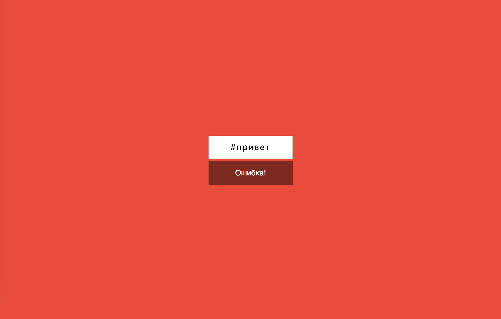

### Build status:  

# Конвертер цветов из HEX в RGB

### Deployment:  <a href="https://sergius92739.github.io/ra-4.1-forms-hex2rgb/">Github Pages</a>

---

Вам необходимо разработать конвертер цветов из HEX в RGB.

## Интерфейс конвертера

При правильном вводе цвета он показывает его представление в формате RGB и меняет цвет фона на заданный цвет:

Конвертер при вводе неправильного цвета в формате HEX должен сообщать об ошибке:

Необходимо дожидаться ввода всех 7-ми символов (включая решётку), чтобы принимать решение о том, показывать ошибку или менять цвет фона.